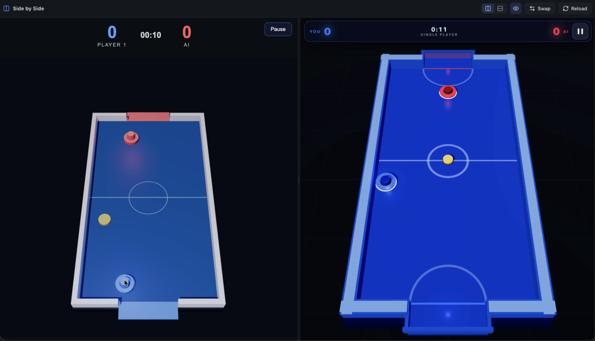

# Side by Side

**View two sites — or two local dev servers — side by side in one browser window.**

On npm as [`sbs-view`](https://www.npmjs.com/package/sbs-view) — the command is
`sbs`. See [About](#about) for why the names differ.

[](LICENSE)
[](package.json)
[](package.json)



```bash
sbs :3000 :5173
```

Comparing two versions of a page usually means two browser windows fighting for
screen space, or tabs you cannot look at at the same time. `sbs` gives you one
window, two panes, a draggable divider, and it remembers what you had open.

## Install

Requires **Node 20 or newer**. There are no dependencies to install.

```bash
npm install -g sbs-view     # puts `sbs` on your PATH
```

Or run it from a checkout without installing:

```bash
git clone https://github.com/anduraio/sidebyside.git
cd sidebyside
npm link                    # puts `sbs` on your PATH
```

## Usage

```
sbs [url] [url] [options]

  -p, --port <port>   port for the viewer            (default: 4747)
      --host <host>   interface to bind              (default: 127.0.0.1)
  -P, --proxy         start both panes in proxy mode
  -s, --stacked       stack the panes vertically
  -n, --no-open       do not open a browser
  -h, --help          show help
  -v, --version       show version
```

Addresses without a scheme default to `https`, except localhost, loopback and
private network addresses, which default to `http`.

```bash
sbs                      # open the viewer with both panes empty
sbs :3000 :5173          # two dev servers
sbs 3000 5173            # bare port numbers work too
sbs :3000 example.com    # your dev server next to the live site
sbs --proxy old.test new.test
```

If the port you ask for is taken, the next free one is used and the banner says so.

## Direct vs Proxy

Every pane has a **Direct** / **Proxy** toggle, because the two situations are
genuinely different.

**Direct** embeds the site in an iframe exactly as it is. Dev servers allow this,
so it is the right choice for `localhost`: hot module reload, websockets, service
workers and client-side routing all behave normally.

**Proxy** routes the page through `sbs` and strips the headers that stop a site
from being embedded — `X-Frame-Options` and the CSP `frame-ancestors` directive.
Most public sites send one or both, which is exactly why they refuse to load in a
frame.

You rarely have to choose. When you enter an address, `sbs` checks whether the
site can be framed at all. If it cannot, the pane switches itself to Proxy and
tells you why, with an **Undo** button if you disagree.

Both modes are one click apart in each pane's toolbar, so the guess is always
easy to override.

## Keyboard shortcuts

| Keys | Action |
| --- | --- |
| `Alt` `1` / `Alt` `2` | Focus the left / right address bar |
| `Alt` `R` | Reload both panes |
| `Alt` `S` | Swap the panes |
| `Alt` `M` | Toggle Direct/Proxy on the focused pane |
| `Alt` `F` | Fullscreen the focused pane |
| `Alt` `B` | Hide/show the pane toolbars |
| `Esc` | Leave fullscreen, or revert the address bar |

Drag the divider to resize the panes; double-click it to reset to 50/50.

Layout, addresses, modes, split position and toolbar visibility are remembered in
`localStorage`, so reloading the viewer brings you straight back.

### Hiding the toolbars

The eye button in the header (or `Alt` `B`) hides the per-pane address bars,
giving the two pages the full height of the window. The header stays put so the
button is always within reach, and it highlights while the toolbars are hidden.

## How it works

```
browser ──> sbs (127.0.0.1:4747)
              ├── /                          the viewer UI
              ├── /api/probe?url=…           can this site be framed?
              └── /p/<scheme>/<host>/<path>  the proxy
                        └──> the real site
```

A proxied page is served from `/p/http/localhost:3000/some/page`, so relative
URLs keep resolving correctly and only root-relative ones need rewriting.

The proxy:

- rewrites root-relative URLs across HTML, CSS, `srcset` and inline styles
- rewrites `Location`, `Set-Cookie`, `Origin` and `Referer`
- drops hop-by-hop headers and the frame-blocking ones
- removes `frame-ancestors` and `sandbox` from CSP, and adds `'self'` to an
  existing `script-src` when it is missing, so the injected shim can load on
  sites with a strict policy. The rest of the policy is left intact.
- pipes websocket upgrades, so HMR survives proxying
- injects a small script that patches `fetch`, `XMLHttpRequest` and `pushState`
  for URLs a page builds at runtime
- decodes bodies using the charset the response declares, rather than assuming
  UTF-8

The viewer binds to `127.0.0.1` and rejects requests whose `Host` header is not a
loopback name, so a page on another origin cannot reach it through DNS rebinding.

## Limitations

Proxy mode is a best-effort fallback, not a browser. Worth knowing before you
reach for it:

- **Scripts that read `location.pathname` see the proxy path.** Single-page apps
  that do their own routing can misbehave; switch that pane to Direct.
- **Cookie-based logins mostly work**, but a site that depends on its own domain
  may not.
- **The probe is a header-only check.** A site that only blocks framing on
  certain routes can still come up blank — flip the toggle and carry on.
- **A site with no `script-src` is left alone**, so on those the runtime-URL shim
  does not load. Inventing a `script-src` would override `default-src` and cut
  the site off from its own scripts, which is worse than a missing shim.
- Direct mode is subject to the browser's own iframe rules, which cannot be
  worked around by definition.

## About

It started as a small annoyance: comparing a dev server against production, or
two branches, or two ports, meant juggling browser windows and losing track of
which was which. Two panes in one window fixes that, and remembering what you
had open means you rarely have to set it up twice.

Side by Side runs entirely on your machine. Nothing is collected, nothing is
sent anywhere, and the only network traffic is the two pages you asked for. The
viewer binds to loopback so nothing else can reach it.

There are no dependencies. The proxy, the URL rewriting and the UI are built on
Node's standard library and the browser, which keeps the install to nothing and
means `git clone` is a complete checkout.

The name is spread across three namespaces, which is worth stating plainly:

| | |
| --- | --- |
| Repository | [`sidebyside`](https://github.com/anduraio/sidebyside) |
| Package | [`sbs-view`](https://www.npmjs.com/package/sbs-view) — `sidebyside` was already taken on npm |
| Command | `sbs` |

## Development

```bash
npm test          # node --test test/
```

The suite covers URL parsing, proxy path handling, HTML and CSS rewriting, header
rewriting, cookie rewriting, and charset decoding.

| Path | |
| --- | --- |
| `bin/sbs.js` | executable entry point |
| `src/cli.js` | argument parsing, URL normalisation, banner |
| `src/server.js` | HTTP server, routes, probe endpoint, host guard |
| `src/proxy.js` | proxy engine: headers, rewriting, websockets |
| `public/` | viewer UI |
| `docs/` | screenshot |

## Contributing

Issues and pull requests are welcome. If you are touching the proxy, run
`npm test` first — the URL rewriting rules have sharp edges, and the tests
encode a fair amount of the reasoning behind them.

## License

[MIT](LICENSE) © anduraio
